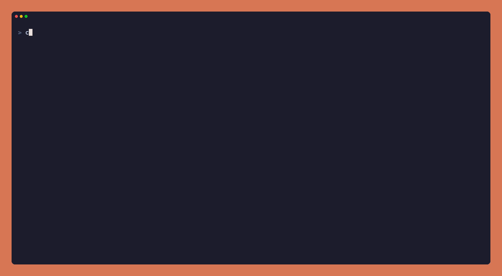
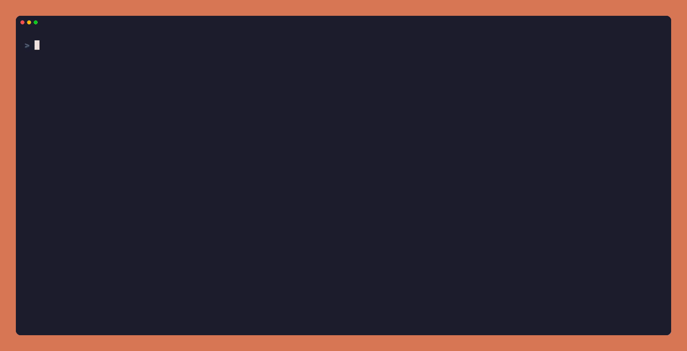
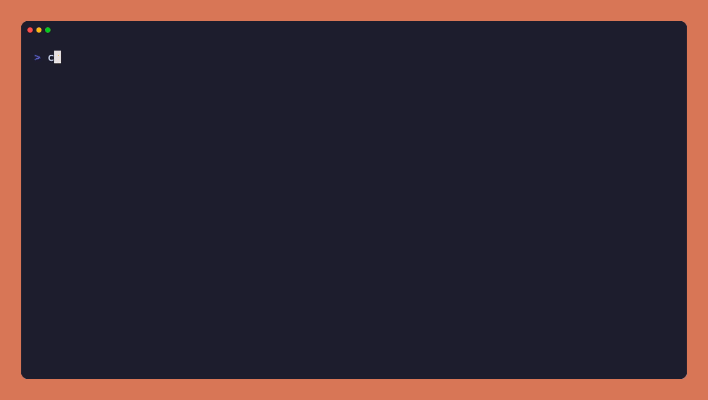
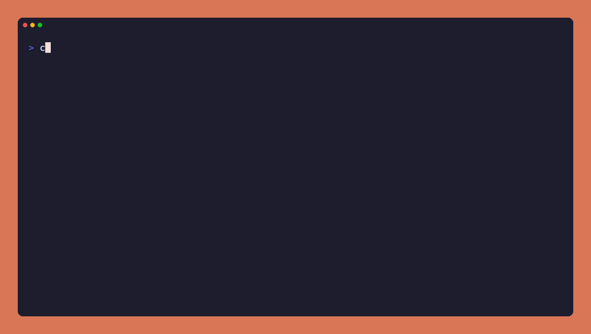
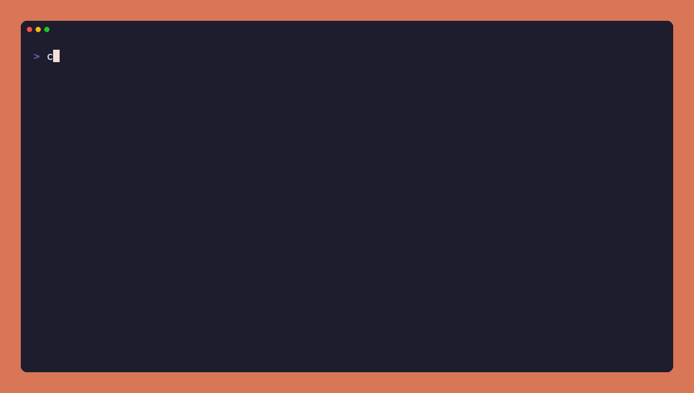

# wop-worktrees

[](https://github.com/FLampa/wop-worktrees/actions/workflows/ci.yml)
[](LICENSE)
[](https://code.claude.com/docs/en/plugins/mods/create)

Claude Code mod for wop per-branch environments: see, switch and clean up worktrees from your chats.

<p align="center">
  
</p>

[wop](https://github.com/sofiandreoli/wop-releases) gives each git branch its own worktree,
ports and database. This [mod](https://code.claude.com/docs/en/plugins/mods/create) keeps the
chat's environment in view, moves the chat between environments without leaving Claude Code,
tells Claude which ports and database to use, and asks what to do with each environment when
you exit, so none are left running by accident.

## Contents

- [Install](#install)
- [Features](#features)
- [Usage](#usage)
- [Optional setup](#optional-setup)
- [Limitations](#limitations)
- [Development](#development)
- [License](#license)

## Install

Requirements:

- Claude Code 2.1.295 or newer (mods are early access and change between releases)
- `wop` 3.x on your `PATH`
- `jq` and `bash`, for the optional shell wrapper and `claude -w` scripts

At the Claude Code prompt:

```
/plugin install wop-worktrees --marketplace FLampa/wop-worktrees
```

Answer `y` to add the marketplace and pick the user scope. A local-scope install only loads in
the checkout that holds it, not in its worktrees. The mod draws nothing outside repos with wop
environments.

To offer it to everyone working on a project, commit this to the project's
`.claude/settings.json`:

```json
{
  "extraKnownMarketplaces": {
    "wop-worktrees": { "source": { "source": "github", "repo": "FLampa/wop-worktrees" } }
  },
  "enabledPlugins": { "wop-worktrees@wop-worktrees": true }
}
```

## Features

### See and switch environments

The right end of the prompt footer shows the environment the chat is in and a button:
`⎇ ● login :5100 · View all worktrees (2) ⌃Q`. The worktree list has one card per wop
environment (services, ports, database) and one line per plain git worktree. Picking one moves
the chat there, restarting stopped services first.

<p align="center">
  
</p>

### Claude knows the environment

A chat in a wop environment gets its ports, web URL and database in its context, plus "leave
other environments alone", so it doesn't guess port 3000. Moving mid-chat adds a short note
instead of rewriting that context, which keeps Claude's prompt cache.

### Clean up when you exit

For each environment the chat used, `/exit` asks *Keep running*, *Stop services* (`wop stop`)
or *Tear down* (`wop down`). It warns about uncommitted changes, commits that are on no remote,
and other chats working in the same worktree.

<p align="center">
  
</p>

### Resume where you left off

Claude Code resumes a chat in the folder you run `claude --resume` from. If the chat was in
another worktree of the same repo when it closed, the mod moves it back there.

A chat uses an environment when its working directory is inside it, a tool call names it, or
Claude ran `wop up`/`wop restart` for its branch, even if the environment registers minutes
later.

## Usage

Open the worktree list with `/worktrees`, a click on the footer button, or
[Ctrl+Q](#ctrlq-for-the-worktree-list).

| Key | In the worktree list |
| --- | --- |
| `↑` `↓` | Move between environments and worktrees |
| `⏎` | Move the chat there |
| `x` | Tear down the wop environment (`wop down`) or remove the git worktree, after asking |
| `u` | Stop tracking an environment the chat only looked at, so `/exit` skips it |
| `Esc` | Close the list |

`/exit` asks about every environment the chat used. `Esc` at that prompt cancels the exit.

## Optional setup

### Ctrl+Q for the worktree list

Mods can't read keys directly, but a mod button can name one of Claude Code's keybinding
actions and be pressed by your binding for it. The list buttons use `app:cycleDiffBase`, which
Claude Code only handles while `/diff`'s panel is open. Add this to
`~/.claude/keybindings.json` (an object with a `bindings` array; a bare array is rejected):

```json
{
  "bindings": [
    { "context": "Global", "bindings": { "ctrl+q": "app:cycleDiffBase" } }
  ]
}
```

While `/diff`'s panel is open, Ctrl+Q cycles its diff base instead.

### Ask after Ctrl+C

A mod can't catch Ctrl+C: Claude Code reserves the key, and nothing can be asked once the
interface is closing. So the mod hands the chat's environments to a `claude` shell function
instead, which asks *keep running*, *stop services* or *tear down* after Claude Code exits,
with the same warnings. It asks nothing after `/exit` (the mod already did), after `claude -p`,
or when the terminal isn't interactive.

Add this to `~/.zshrc` or `~/.bashrc`, with the path to a clone of this repo:

```bash
source /path/to/wop-worktrees/scripts/claude-wrapper.sh
```

Closing the terminal tab skips the question, since the shell goes with it.

<p align="center">
  
</p>

### `claude -w <type>/<name>` through wop

`scripts/worktree-create.sh` and `scripts/worktree-remove.sh` are `WorktreeCreate` and
`WorktreeRemove` hooks. With them, `claude -w feature/login` runs `wop up` and starts the chat
in the new environment. A branch that only exists on the remote is checked out from it, and a
new one starts from the remote's default branch. On exit, Claude Code's own keep/remove prompt
runs `wop down` on *Remove*, and the mod runs `wop stop` on *Keep*. Names without a `/` (and
subagent worktrees) get a plain git worktree under `.claude/worktrees/`.

<p align="center">
  
</p>

The hooks must live in a settings file, because hooks a plugin declares load too late for
`--worktree`. Clone this repo somewhere stable and add to your user or project settings:

```json
{
  "hooks": {
    "WorktreeCreate": [
      { "hooks": [{ "type": "command", "command": "\"/path/to/wop-worktrees/scripts/worktree-create.sh\"", "timeout": 1200 }] }
    ],
    "WorktreeRemove": [
      { "hooks": [{ "type": "command", "command": "\"/path/to/wop-worktrees/scripts/worktree-remove.sh\"", "timeout": 300 }] }
    ]
  }
}
```

## Limitations

- **No prompt inside Claude Code on Ctrl+C or Ctrl+D.** Only `/exit` asks there. The shell
  wrapper asks afterwards, and `claude -w` chats get Claude Code's own keep/remove prompt.
- **No Down-arrow access** to the footer button. Use a click, `/worktrees` or Ctrl+Q.
- **Clicking needs fullscreen rendering** (`"tui": "fullscreen"`).
- **Other chats are seen only if they run this mod.** Each chat records its directory under
  `~/.claude/wop-worktrees/chats/`.
- **Tear down is `wop down`.** It deletes the worktree folder, uncommitted work included, and
  drops its databases. The git branch stays.

## Development

```bash
claude plugin validate .
claude plugin test .
```

`claude --plugin-dir .` loads your working copy for one session. Run `tsc -p .` for type
checks: Claude Code writes the API types to `.claude-plugin/types/` the first time it loads the
mod from a folder it watches.

The GIFs are [VHS](https://github.com/charmbracelet/vhs) tapes in `demo/`. `demo/record.sh`
records all of them, or only the ones you name (`demo/record.sh hero exit`). For each tape it
builds a throwaway repo with two wop environments in `/Users/Shared/acme-shop`, records, and
removes the repo again. Claude Code runs through `demo/bin/claude`, which skips your own
settings and loads this working copy. It needs `vhs`, `wop`, Postgres and a signed-in Claude
Code. Claude Code must trust that folder first: run `demo/setup.sh`, start `claude` in
`/Users/Shared/acme-shop` once to accept the trust prompt, then run `demo/setup.sh down`.

Issues and pull requests are welcome. CI runs the two commands above and `shellcheck`.

## License

[MIT](LICENSE)
